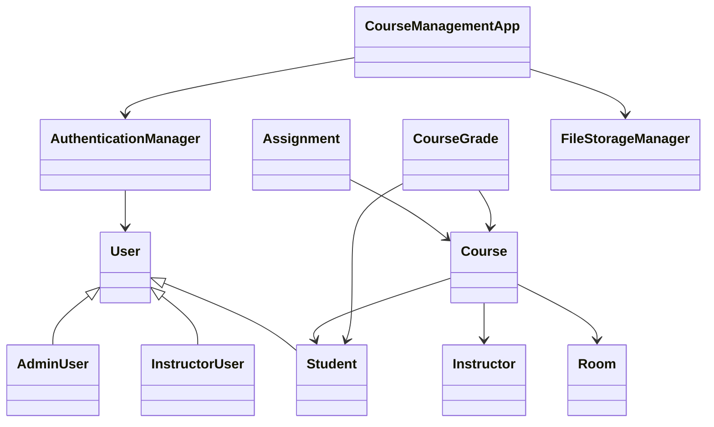

# Course Management System

## Table of Contents
- [Project Overview](#project-overview)
- [Project Structure](#project-structure)
- [Core Java Packages and Classes](#core-java-packages-and-classes)
- [Resources](#resources)
- [Serialized Data Files](#serialized-data-files)
- [Configuration & Build Files](#configuration--build-files)
- [Other Files](#other-files)
- [How It Works](#how-it-works)
- [Credits](#credits)

---

## Project Overview

The **Course Management System** is a modular, object-oriented JavaFX application that enables effective management of users, courses, enrollments, assignments, and grades. This system provides separate interfaces for administrators, instructors, and students, allowing differentiated access and functionality appropriate to each user type. It persistently stores data using serialization and supports robust authentication and logging.

---

## Project Structure

```
CourseManagementSystem/
│
├── assignments.ser
├── courses.ser
├── enrollments.ser
├── grades.ser
├── instructor_assignments.ser
├── nbactions.xml
├── pom.xml
├── src/
│   ├── main/
│   │   ├── java/
│   │   │   └── com/coursemanagement/
│   │   │        ├── AdminUser.java
│   │   │        ├── Assignment.java
│   │   │        ├── AuthenticationManager.java
│   │   │        ├── Course.java
│   │   │        ├── CourseGrade.java
│   │   │        ├── CourseManagementApp.java
│   │   │        ├── CourseReportGenerator.java
│   │   │        ├── CourseSurvey.java
│   │   │        ├── EnhancedAuthenticationManager.java
│   │   │        ├── EnhancedCourseManager.java
│   │   │        ├── ErrorHandlingUtil.java
│   │   │        ├── FileStorageManager.java
│   │   │        ├── Instructor.java
│   │   │        ├── InstructorUser.java
│   │   │        ├── LoggingUtil.java
│   │   │        ├── MainApplication.java
│   │   │        ├── Room.java
│   │   │        ├── Student.java
│   │   │        ├── User.java
│   │   │        └── ValidationUtil.java
│   │   └── resources/
│   │        └── com/coursemanagement/
│   │             ├── primary.fxml
│   │             └── secondary.fxml
│   └── test/
│       └── java/
└── users.ser
```

---

## Core Java Packages and Classes

### `com.coursemanagement`
- **AdminUser.java**  
  User subclass for admin accounts, includes permission management and admin level distinctions (e.g. Standard, SuperAdmin).
- **Assignment.java**  
  Represents a course assignment with fields for courseName, title, due date, and status.
- **AuthenticationManager.java**  
  Core authentication engine: manages users, login/logout, registration, persistent user database.
- **Course.java**  
  Represents a course, with info such as courseId, name, instructor, schedule, enrolled students, and metadata.
- **CourseGrade.java**  
  Represents a student's grade in a course, including grade and percentage earned.
- **CourseManagementApp.java**  
  The main JavaFX entry point. Controls UI, scene management, persistent data loading/saving, and role-based dashboard.
- **CourseReportGenerator.java**  
  (Presumed) Generates reports about course statistics or usage for administrators.
- **CourseSurvey.java**  
  (Presumed) Manages feedback or survey collection related to courses.
- **EnhancedAuthenticationManager.java, EnhancedCourseManager.java**  
  Provide advanced or extended features over their base manager classes.
- **ErrorHandlingUtil.java**  
  Utility for catching, logging, and managing errors or displaying user-friendly messages.
- **FileStorageManager.java**  
  Generic handler for serialization/deserialization of data models (supports type safety).
- **Instructor.java**  
  Data class or interface for representing an instructor.
- **InstructorUser.java**  
  Subclass of User specific to instructor privileges/role.
- **LoggingUtil.java**  
  Centralized logging: used for tracking events, errors, and audits.
- **MainApplication.java**  
  (Likely) Alternative or test application entry point, or pre-JavaFX migration. (Check if used)
- **Room.java**  
  Associates a physical or virtual room with courses.
- **Student.java**  
  User subclass for student accounts; holds student-specific info.
- **User.java**  
  Abstract/interface base for all user types. Unifies email, userId, password, etc.
- **ValidationUtil.java**  
  Common validation routines for user input and data consistency.
- **module-info.java**  
  Java module definition for modular builds; specifies module boundaries/dependencies.

---

## Resources

### `/src/main/resources/com/coursemanagement/`
- **primary.fxml**, **secondary.fxml**  
  JavaFX UI layout files (FXML). Define component arrangement, scene structure, and bindings for application interfaces.

---

## Serialized Data Files

These `.ser` files store persisted application data using Java serialization:
- **users.ser** — All registered user account data.
- **courses.ser** — All course definitions and metadata.
- **enrollments.ser** — Mapping between students and their enrolled courses.
- **assignments.ser** — Details for assignments attached to courses.
- **grades.ser** — Student grade records for each course.
- **instructor_assignments.ser** — Which instructors are assigned to which courses.

---

## Configuration & Build Files

- **pom.xml**  
  Maven config: manages dependencies, Java version, and build process for the project.
- **nbactions.xml**  
  NetBeans-specific actions or project custom tasks.

---

## How It Works

### High-Level Flow
- On startup, data is loaded from `.ser` files using `FileStorageManager`.
- Login scene presented; user authenticates via `AuthenticationManager`.
- Role-based dashboards are shown: Admin, Instructor, Student.
- Each role offers tailored functionality (course management, grading, assignment creation, enrollment, etc).
- Changes (e.g. new courses, grades) are saved back to respective `.ser` files.
- All significant actions are logged via `LoggingUtil` for traceability.

### Example Class Diagram



---

## Credits

- **Designed & Implemented by:** Ahmed Abo Baker
- **Course:** Advanced Programming
- **Contributors:** [Add here]
- **Contact:** [Add contact/email]

---

*This documentation was auto-generated for clarity and onboarding new developers or system administrators. For more detailed class/method documentation, refer to inline JavaDoc comments in the source.*
